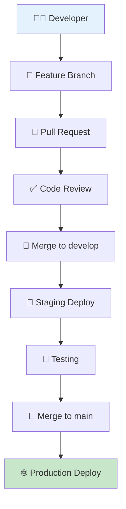
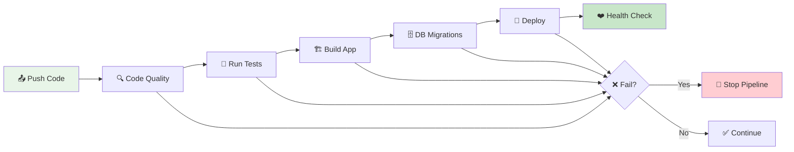
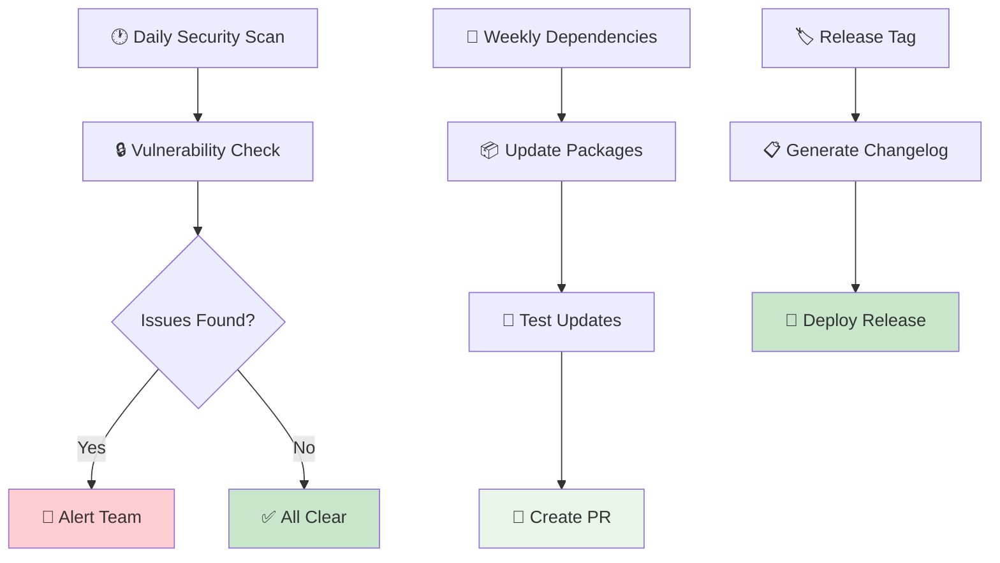
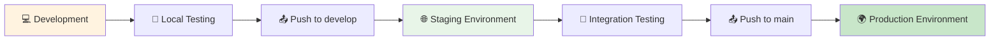
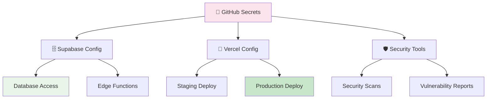
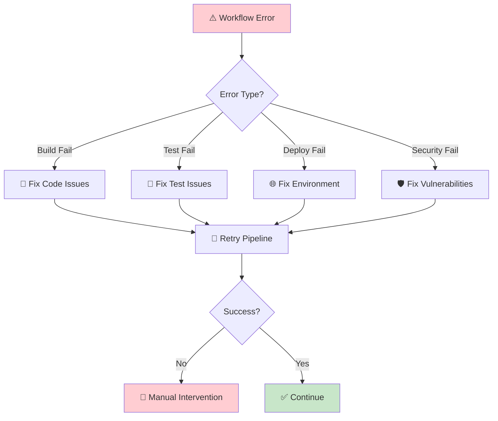

# Growth Mentor Grid - Simple Workflow Diagram

## 🚀 High-Level Workflow Overview



## 🔄 CI/CD Pipeline Flow



## 🛡️ Security & Maintenance



## 🌍 Environment Flow



## 📊 Branch Strategy

```mermaid
gitgraph
    commit
    branch develop
    checkout develop
    commit
    commit
    checkout main
    merge develop
    commit
    checkout develop
    commit
    checkout main
    merge develop
```

## 🔐 Configuration & Secrets



## 🚨 Error Handling



## 📱 Quick Reference

### 🚀 **Main Workflow**
1. **Push Code** → **Quality Check** → **Tests** → **Build** → **Deploy**

### 🛡️ **Security**
- **Daily Scans** at 2 AM UTC
- **Weekly Updates** on Mondays
- **Automated Alerts** for issues

### 🌍 **Environments**
- **develop** → Staging (auto-deploy)
- **main** → Production (auto-deploy)
- **Manual** → Any environment

### 🔑 **Required Secrets**
- Supabase: URL, Keys, Tokens
- Vercel: Token, Org ID, Project ID
- Security: Snyk Token (optional)

### 📅 **Schedules**
- **Security**: Daily at 2 AM UTC
- **Dependencies**: Weekly on Monday at 6 AM UTC
- **Deployments**: On every push to main/develop

---

## 🎯 **Key Benefits**

✅ **Automated Quality Gates** - Code can't deploy without passing tests  
✅ **Security First** - Daily vulnerability scanning  
✅ **Zero Downtime** - Automated deployments with health checks  
✅ **Rollback Ready** - Easy to revert problematic deployments  
✅ **Team Collaboration** - Automated PR creation and review processes  
✅ **Monitoring** - Health checks and deployment confirmations  

## 🔧 **Quick Start**

1. **Run Setup Script**: `scripts/setup-workflows.bat` (Windows)
2. **Configure Secrets** in GitHub repository
3. **Push to develop** for staging deployment
4. **Push to main** for production deployment
5. **Monitor** in GitHub Actions tab

---

*This simplified diagram shows the core workflow. For detailed technical information, see the complete `workflow-diagram.md` file.*
