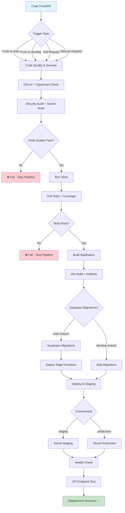
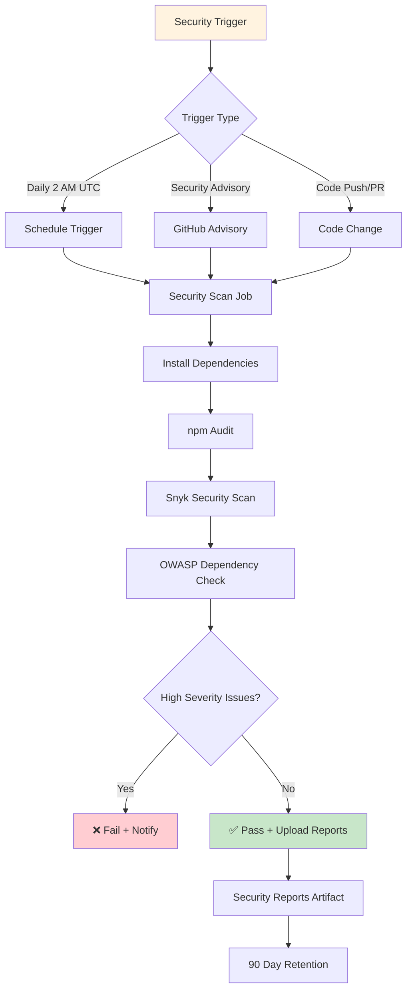
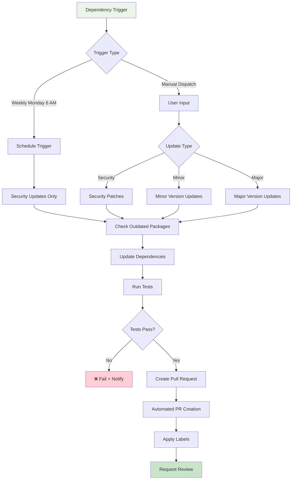
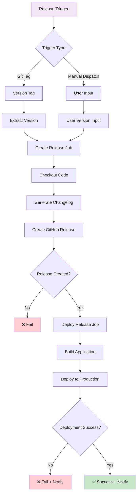
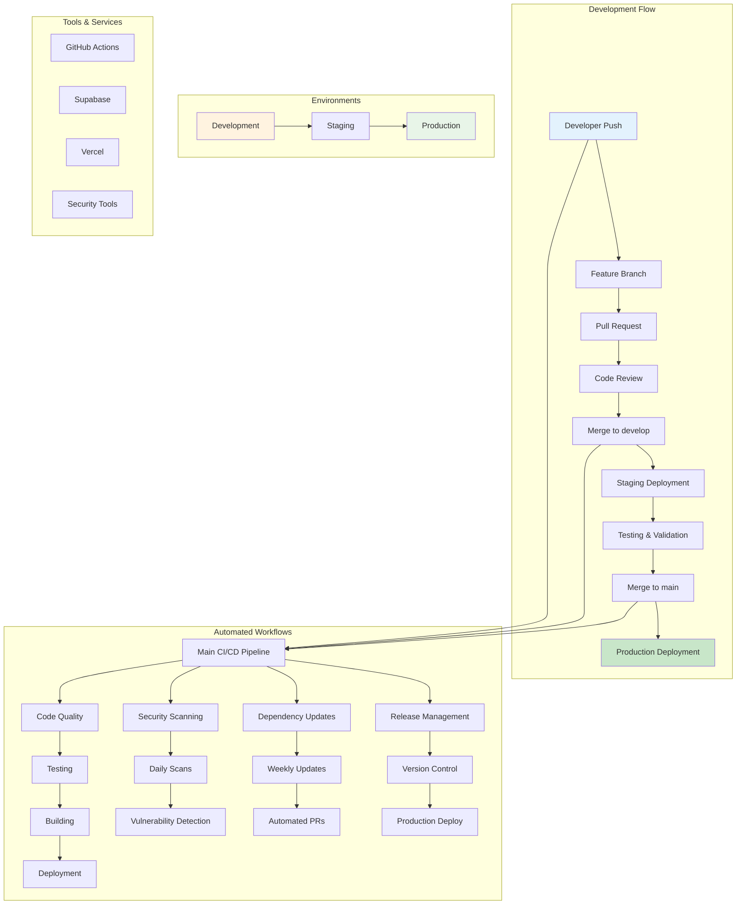
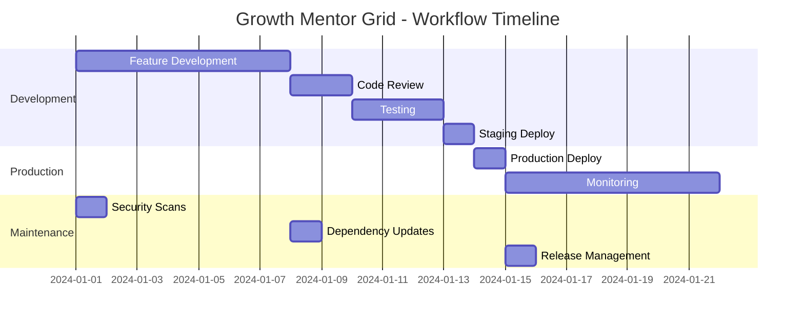
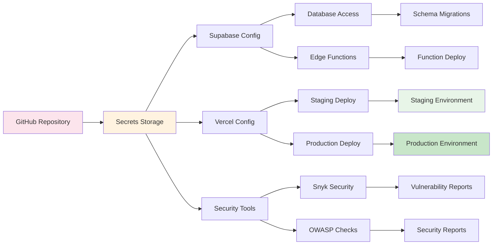
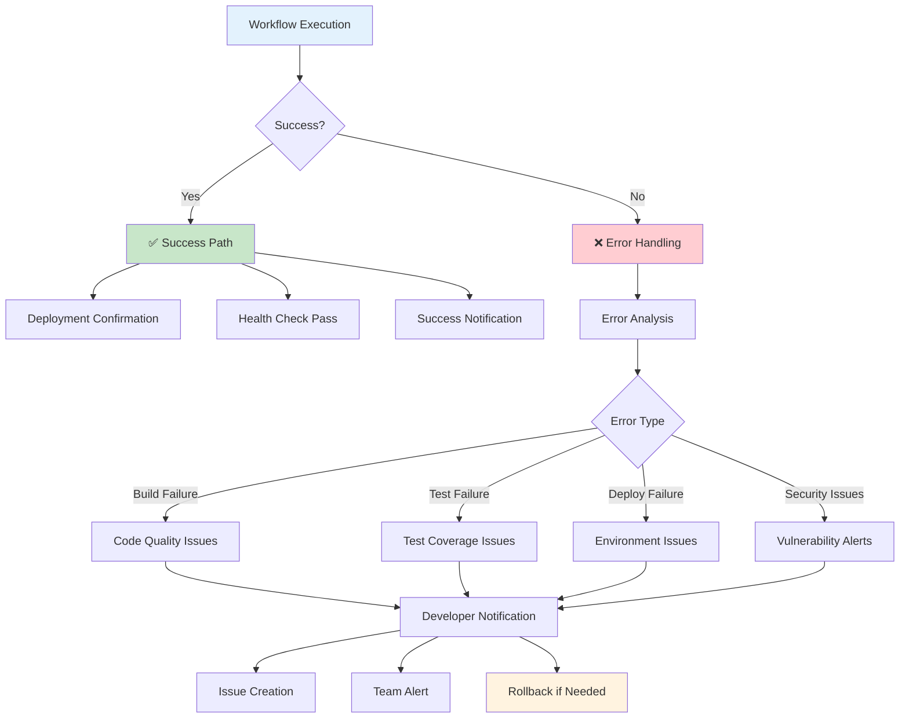
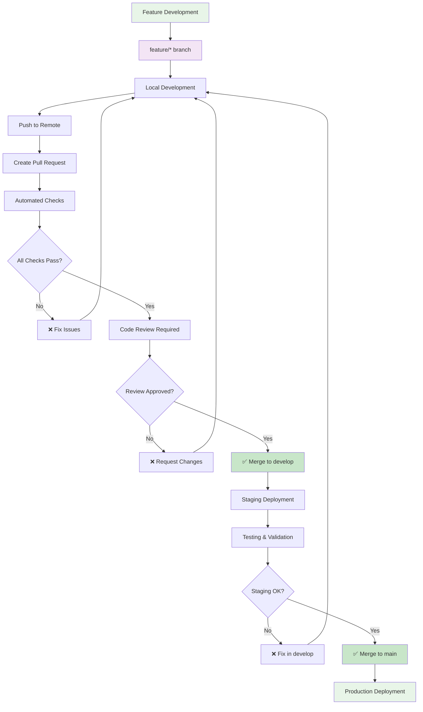

# Growth Mentor Grid - Workflow Diagram

This document provides visual representations of the workflow system using Mermaid diagrams.

## 🔄 Main CI/CD Pipeline Flow

## 🛡️ Security Scanning Workflow

## 📦 Dependency Updates Workflow

## 🏷️ Release Management Workflow

## 🚀 Complete Workflow System Overview

## 📊 Workflow Timeline

## 🔐 Secrets & Configuration Flow

## 🚨 Error Handling & Notifications

## 📱 Branch Strategy & Protection

---

## 📋 Diagram Legend

- **🟦 Blue**: Development and workflow triggers
- **🟩 Green**: Success states and production
- **🟥 Red**: Failures and errors
- **🟨 Yellow**: Warnings and notifications
- **🟪 Purple**: Configuration and setup
- **🟧 Orange**: Maintenance and monitoring

## 🔧 How to Use These Diagrams

1. **Copy the Mermaid code** from any diagram above
2. **Paste into**:
   - GitHub markdown files (GitHub supports Mermaid natively)
   - Mermaid Live Editor: https://mermaid.live/
   - VS Code with Mermaid extension
   - Any Mermaid-compatible viewer

3. **Customize** the diagrams by modifying the Mermaid code to match your specific workflow requirements

4. **Embed** in documentation, presentations, or team wikis

## 📚 Related Documentation

- **Complete Workflow Guide**: `WorkflowGuide.md`
- **Setup Instructions**: `scripts/setup-workflows.*`
- **Workflow Files**: `.github/workflows/*.yml`
